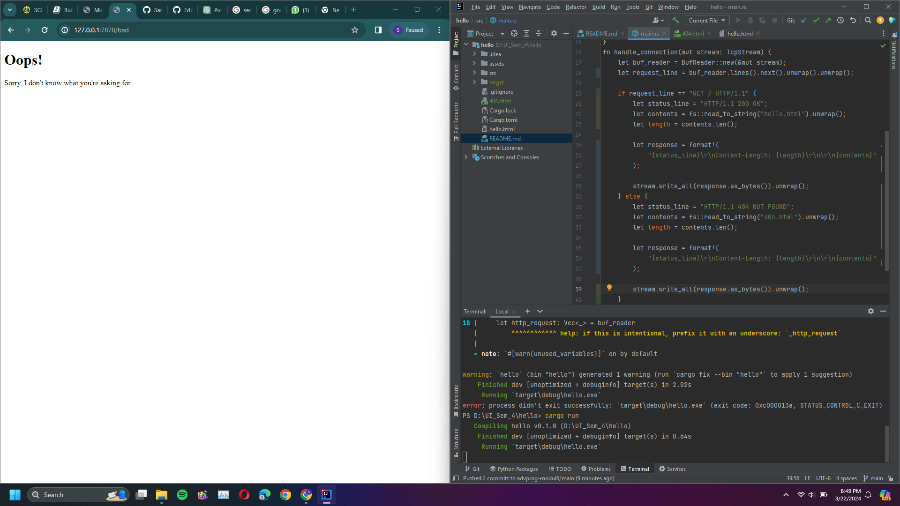
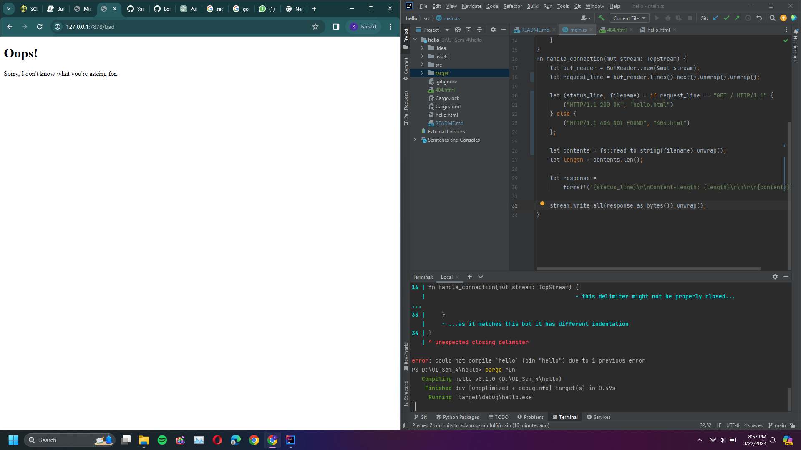

# advprog-modul6

Pekan 1:

Commit 1 Reflection notes: You may need to check the Rust documentation to understand what is inside the handle_connection method. Write as reflection notes in the Readme.md.

fn handle_connection(mut stream: TcpStream) {
    let buf_reader = BufReader::new(&mut stream);
    let http_request: Vec<_> = buf_reader
        .lines()
        .map(|result| result.unwrap())
        .take_while(|line| !line.is_empty())
        .collect();
    println!("Request: {:#?}", http_request);
}

"let buf_reader = BufReader::new(&mut stream);": Line ini membuat BufReader instance yang membuat reference mutable ke stream.

"let http_request: ": Line ini membuat variabel http_request untuk mengambil baris request dari server.

"Vec<_>": Line ini menunjukkan bahwa kita ingin baris request tersebut dalam bentuk vektor.

".lines()": Method ini menunjukkan bahwa akan dikembalikan iterator baris dari BufReader.

".map(|result| result.unwrap())": Method ini meng-unwrap setiap Result yang diberikan iterator yang akan menghasilkan Ok atau panic.

".take_while(|line| !line.is_empty())": Method ini mengambil baris dari iterator hingga ketemu baris kosong (akhir dari HTTP header).

".collect()": Method ini mengumpulkan baris dari iterator dan diubah jadi vektor.

"println!("Request: {:#?}", http_request)": Line ini menampilkan hasil ke console.

Commit 2 Reflection notes: You may need to edit the hello.html to write your own message.
Capture your screen, put it as file such as commit2.png and put it in your Readme.md.

Commit 3 Reflection notes: You better do up to the refactoring one, and you need to explain in your reflection notes, how
to split between response and why the refactoring is needed. You also need to capture your
own screen shot, with your own message. 

Perbedaan respons dicek di kriteria if-else. Line " if request_line == "GET / HTTP/1.1" " mengecek jika request client sesuai
dengan permintaan, dan jika iya akan memunculkan isi hello.html, sedangkan apapun selain hasil tersebut, seperti 127.0.0.1:7878/bad
akan jatuh ke kondisi else yang akan memunculkan 404.html.

Refactoring dibutuhkan karena terdapat repetisi pada bagian if-else, di mana keduanya mengakses suatu file name
dan mengeluarkan konten file html ke layar, hal ini merupakan contoh code smells. Untuk mengatasi hal ini, perintah yang 
mengakses dan mengisi html dikeluarkan dari if-else, sehingga if-else hanya berisi perbedaan pada GET request dan file htmlnya.

Commit 4 Reflection notes: Let’s open two of browser windows, try 127.0.0.1/sleep in one of them, and try in other
windows 127.0.0.1. Pay attention that the browser take some time to load. You can imagine if
many users try to access it. See how it works and try to understand why it works like that. 

thread::sleep(Duration::from_secs(5)); Line ini akan membuat ketika 127.0.0.1/sleep diakses, maka server akan sleep
selama 5 detik sebelum mulai merespon.

Commit 5 Reflection notes: Try to understand how the ThreadPool works. 

ThreadPool adalah kumpulan thread yang telah di spawn  menunggu untuk mengeksekusi suatu task. Satu task dilakukan oleh 
satu thread, dan sisanya menunggu untuk task lain. Ketika task selesai, thread akan kembali menunggu task di ThreadPool.
Jumlah thread umumnya dibatasi untuk menghindari terkena serangan DoS. Kita juga bisa mendefinisikan data struktur Worker 
sebagai tempat thread dispawn dan menunggu kode, serta data struktur Job yang memegang task yang akan diberikan thread melalui
channel. Terakhir, kita dapat mengimplementasikan drop untuk memastikan setiap thread menyelesaikan seluruh task mereka 
sebelum di close. Secara kesimpulan, konsep threadpool dan thread sangat bermanfaat dalam menyelesaikan beberapa task sekaligus.
