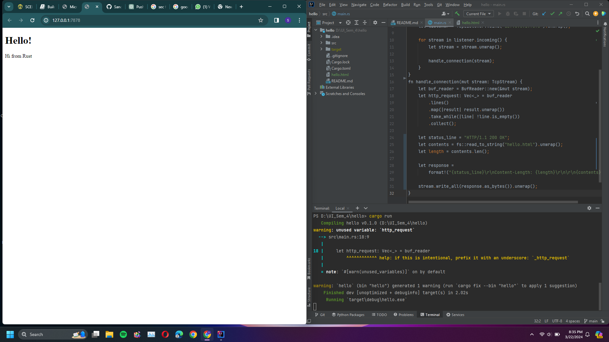

# advprog-modul6

Pekan 1:

Commit 1 Reflection notes: You may need to check the Rust documentation to understand what is inside the
handle_connection method. Write as reflection notes in the Readme.md.

Request: [
"GET / HTTP/1.1",
"Host: 127.0.0.1:7878",
"Connection: keep-alive",
"Cache-Control: max-age=0",
"sec-ch-ua: \"Chromium\";v=\"122\", \"Not(A:Brand\";v=\"24\", \"Google Chrome\";v=\"122\"",
"sec-ch-ua-mobile: ?0",
"sec-ch-ua-platform: \"Windows\"",
"Upgrade-Insecure-Requests: 1",
"User-Agent: Mozilla/5.0 (Windows NT 10.0; Win64; x64) AppleWebKit/537.36 (KHTML, like Gecko) Chrome/122.0.0.0 Safari/537.36",
"Accept: text/html,application/xhtml+xml,application/xml;q=0.9,image/avif,image/webp,image/apng,*/*;q=0.8,application/signed-exchange;v=b3;q=0.7",
"Sec-Fetch-Site: cross-site",
"Sec-Fetch-Mode: navigate",
"Sec-Fetch-User: ?1",
"Sec-Fetch-Dest: document",
"Accept-Encoding: gzip, deflate, br, zstd",
"Accept-Language: en-US,en;q=0.9",
"Cookie: csrftoken=kvgZDdQRMmnz0PIOYjM4MSoTIJ44LZCN",
]

"GET / HTTP/1.1": Line ini memberikan informasi request oleh client. Line ini menunjukkan saya menggunakan metode GET request,
dengan / sebagai URI(Uniform Resource Identifier), dan HTTP/1.1 sebagai versinya.

"Host: 127.0.0.1:7878": Line ini menunjukkan host dan port yang digunakan client.

"Connection: keep-alive": Line ini menunjukkan bahwa client mau membiarkan koneksi terbuka untuk request atau respons HTTP berikutnya.

"Cache-Control: max-age=0": Line ini menunjukkan bahwa server akan menampilkan data baru 0 sekon setelah respons dibuat.

"sec-ch-ua: \"Chromium\";v=\"122\", \"Not(A:Brand\";v=\"24\", \"Google Chrome\";v=\"122\"",
"sec-ch-ua-mobile: ?0",
"sec-ch-ua-platform: \"Windows\""
: Line-line sec-ch-ua menunjukkan brand dan versi agent yang digunakan user.

"Upgrade-Insecure-Requests: 1": Line ini menunjukkan client ingin respons yang di enkripsi dan autentikasi.

"User-Agent: Mozilla/5.0 (Windows NT 10.0; Win64; x64) AppleWebKit/537.36 (KHTML, like Gecko) Chrome/122.0.0.0 Safari/537.36",
Line ini menunjukkan informasi client.

"Accept: text/html,application/xhtml+xml,application/xml;q=0.9,image/avif,image/webp,image/apng,*/*;q=0.8,application/signed-exchange;v=b3;q=0.7",
"Accept-Encoding: gzip, deflate, br, zstd",
"Accept-Language: en-US,en;q=0.9",
: Line-line ini menunjukkan tipe respons yang bisa diterima client.

"Sec-Fetch-Site: cross-site",
"Sec-Fetch-Mode: navigate",
"Sec-Fetch-User: ?1",
"Sec-Fetch-Dest: document",
: Line-line sec-fetch menunjukkan spesifikasi request, seperti context, mode, user credentials, dan destinasi.

"Cookie: csrftoken=kvgZDdQRMmnz0PIOYjM4MSoTIJ44LZCN",: Line ini menunjukkan cookie yang digunakan client. Line ini menunjukkan client
menggunakan CSRF token.

Commit 2 Reflection notes: You may need to edit the hello.html to write your own message.
Capture your screen, put it as file such as commit2.png and put it in your Readme.md.

Commit 2 Reflection notes: You better do up to the refactoring one, and you need to explain in your reflection notes, how
to split between response and why the refactoring is needed. You also need to capture your
own screen shot, with your own message. 

Perbedaan respons dicek di kriteria if-else. Line " if request_line == "GET / HTTP/1.1" " mengecek jika request client sesuai
dengan permintaan, dan jika iya akan memunculkan isi hello.html, sedangkan apapun selain hasil tersebut, seperti 127.0.0.1:7878/bad
akan jatuh ke kondisi else yang akan memunculkan 404.html.

Refactoring dibutuhkan karena terdapat repetisi pada bagian if-else, di mana keduanya mengakses suatu file name
dan mengeluarkan konten file html ke layar, hal ini merupakan contoh code smells. Untuk mengatasi hal ini, perintah yang 
mengakses dan mengisi html dikeluarkan dari if-else, sehingga if-else hanya berisi perbedaan pada GET request dan file htmlnya.

